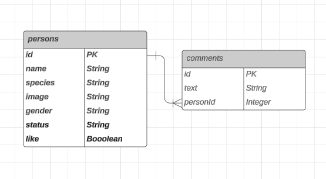

<a name="inicio"></a>

<div align="center">
    
</div>

<div align="center">
    <h3>Technical Test Blossom </br> Rick and Morty</h2>
</div>

## Tabla de contenido

<ol>
  <li>
    <a href="#descripción-del-proyecto">Descripción del Proyecto</a>
    <ul>
      <li><a href="#tecnologías-utilizadas">Tecnologías utilizadas</a></li>
    </ul>
  </li>
  <li>
    <a href="#cómo-empezar">Cómo Empezar</a>
    <ul>
      <li><a href="#pre-requisitos">Pre-requisitos previos</a></li>
      <li><a href="#instalación">Instalación</a></li>
    </ul>
  </li>
</ol>

## Descripción del proyecto

Sitio Web que permite al usuario ver algunos personajes de los famosos dibujos animados de Rick and Morty información tomada de la API <a href="https://rickandmortyapi.com/">The Rick and Morty</a>, donde podras saber si especie, status entre otras cosas.

### Tecnologías utilizadas

|             |            |
| :---------: | :--------: |
|   NodeJS    |  GraphQL   |
|  Sequelize  | TypeScript |
| PostgresSQL |  Tailwind  |
|   Express   |   Dotenv   |
|    React    |    jest    |
|    Axios    |   Apollo   |
|             |            |

<p align="right"><a href="#inicio">⬆ Volver al inicio</a></p>

## Cómo Empezar

En el repositorio encontraremos dos carpetas una con el nombre de backend y otro con el nombre client, actualmente la base de datos es totalmente local. Por lo tanto, deberás seguir estas instrucciones para levantar el proyecto de backend (Api), y despues levantar el frontend (client) sigue los requisitos para poder utilizar este proyecto.

### Pre-requisitos

- DB: Como el proyecto esta desarrollado con PSQL debes contar con un usuario y contraseña ademas de crear una base de datos con el nombre de
  ```sh
  "rick_and_morty"
  ```

### Instalación

1. Clona el repositorio
   ```sh
   git clone https://github.com/RafaMojica/Technical-Test-Blossom.git
   ```
2. Entra a la carpeta de backend, instala las dependencias NPM
   ```sh
   npm install
   ```
3. Entra a la carpeta de client, instala las dependencias NPM

   ```sh
   npm install
   ```

4. Crea un archivo dentro de la carpeta backend en el root y en la carpeta client en el root con el nombre **.env** después usa como base el archivo **.env.example** que se encuentra en ambas carpetas

   ```sh
    #ENV BACKEND
    DB_USERNAME="usuario"
    DB_PASSWORD="password"

    #ENV FRONTED
    VITE_API_URL=http://localhost:${puerto}/graphql
   ```

5. En dos terminales diferentes corre por un lado el servidor y en otra el cliente
   ```sh
   npm run dev
   ```

<p align="right"><a href="#inicio">⬆ Volver al inicio</a></p>

## Diagrama ERD

<div align="center">
    
</div>
